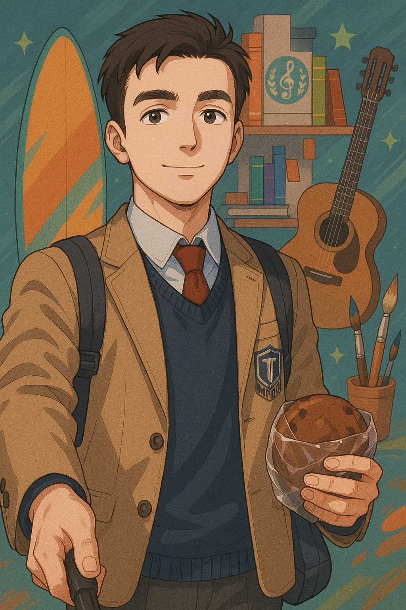

# Добро пожаловать на потрясающий и неповторимый сайт, где вы можете познакомиться со мной, как с невероятно жестким профессионалом во всем, кроме web-разработки

## На фотографии вы можете увидеть, какой я классный

## Что Вы обязаны обо мне знать

   - Пишу на всех языках, так как в совершенстве овладел vibe coding
   - Изучил extended bash - [ebash](https://elibs.github.io/ebash/index.html "Ознакомиться с данным инструментом")
   - Использую Arch, кстати говоря
   - Считаю, что `Hard Skills` > `Soft Skills`, и никак иначе
   - Прошел более 44 собеседований перед тем, как найти первую работу
   - Величайший хоккейный аналитик
   - Владею 3 (тремя) сертификатами от "Минцифры", подтверждающими профессионализм в `Linux`, `Python` и `Docker`
   - Знаю, что такое рекурсия и фрактал
   - Администратор телеграм канала с анекдотами - [Хохмосборник](https://t.me/hohmosbornick "Ознакомиться с данным ресурсом")

## Что Вы не обязаны обо мне знать

   - Использую струну 64-го калибра в православном и струну 74-го калибра в постправославном строях
   - Трижды посмотрел легендарный тайтл `Domekano` от корки до корки
   - Обладаю платиновым трофеем в видеоигре `Bloodborne`
   - Кидаю мяч в кольцо с расстояния в 7.24 метра, иногда даже попадаяю
   - На протяжении долгих лет просматриваю в прямом эфире мероприятия по накатыванию кругов на самых быстрых колесницах мира
   - Вожу ручкой-стилусом над графическим планшетом и нажимаю две кнопки под музыкальное сопрвождение
   - Амбассадор нижнего интернета, повстанец салогвиновточкаком
   - Обожаю хорошее авторское кино, в котором японский дед крутит педали велосипеда 2 часа, или женщина ест все предметы подряд
   - IGL легендарного состава TSK (2015-2015)

## Немаловажно, что я

   - Честный, это видно по странице, на которой Вы сейчас находитесь
   - Весьма тактичный
   - Достаточно вежливый
   - Креативный, в этом усомниться у вас не выйдет
   - Уверенный, как и исполнение сайта, на котором Вы сейчас находитесь
   - Не по годам мудрый
   - Харизматичный харизматик
   - Индивидуальный и незавизимый, владелец собственного `flow` и удивительного `vibe`
   - Спокойный, особенно если рядом нет гитары и 50Вт усилителя
   - Практичный, как и доступность сайта, на котором Вы сейчас находитесь
   - Внатуре очень сильный
   - Не слушаю Рэп
   - Лояльный, верный, преданный, благонадежный, патриотичный и просто `НАШ`
   - Бесспорно очень умный
   - Несомненно очень классный
   - Зовут - `Виктор`, и Вы можете так же

## Краткий список моих достижений

   1. Написал содержимое и провел deploy данного сайта
   2. Сохранил 63% побед и 3к урона на топах за более чем 5000 боев в легендарной онлайн игре про землекопов
   3. Занял со своим коллективом 3-4 место из 64-ех команд на открытом турнире области, по одной из самых популярных киберспортивных дисциплин
   4. Поднял школьный баскетбол района из положения лежа на колени (2017-2018)
   5. Установил `Arch` и заrice'ил его до состояния яркого спорткара на базе `Hyprland`
   6. Поставил рекорд круга в прокатном картинге за день, а ведь это был выходной!
   7. Посмотрел более 100 аниме тайтлов, включая классику вроде `Tonari no Totoro`, `Akira`, `Serial Experiments Lain` и др.
   8. Непринужденно прошел более 40000 шагов за один день
   9. Более 3-ех раз посетил `Сергиев Посад` и его округ
   10. Создал `ambilight` подсветку для монитора на базе `arduino` 
   11. Сумел за месяц полностью пройти `battlepass` первого сезона `Apex Legends`
   12. Записал произведение-манифест `Остановите поезд` для поддержки морального духа всех страдальцев электричек Ярославского направления

## Мои рекомендации Вам
   - Будьте добрым
   - Будьте честным
   - Связаться со мной вы можете с помощью ссылок, что находятся на правой грани вашего экрана, если у вас есть ко мне предложение или благодарность за этот сайт
   - Будьте человеком
   - Не играйте в ММО