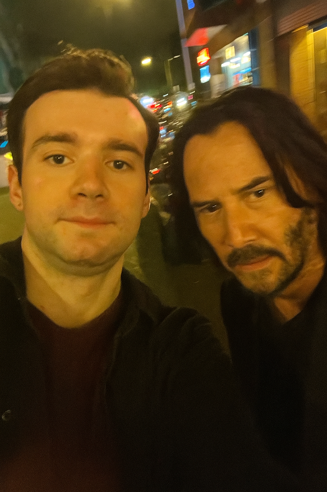

## База
   - Был рожден своей матерью
   - Жестко учился в школе только на пятерки до 8-го класса
   - Не менее жестко учился в школе только на пятерки и 3 четверки до конца обучения
   - Превозмог, затерпел и закончил 11 классов потрясающего МБОУ СОШ
   - Нестыдно проучился 2.5 курса с любовью и страданиями в передовом строительном университете страны – НИУ МГСУ (бывш. МИСИ им. Куйбышева)
   - Достойно поступил на бюджетное обучение в Ордена Трудового Красного Знамени федеральное государственное бюджетное образовательное учреждение высшего образования „Московский технический университет связи и информатики"
   - Продолжаю учиться каждый божий день, ибо зачем тогда вообще божий день существует?
   - Обожаю ОС GNU/Linux, а потому пытаюсь распротранить идею любви к богоподобной ОС
   
   
## Мои пастулаты
   - Работать нужно каждый день!
   - Каждый день нужно работать!
   - Нужно работать каждый день!
   - День работать нужно каждый!

## Мои антипастулаты
   - Не нужно работать каждый день!
   - Не каждый день работать нужно!
   - Работать каждый день не нужно!
   - Не работать нужно каждый день!

## Мои достоинства
   - Внимательно читаю `dmesg`
   - Не чрезмерно, но все же _терпеливый_
   - Необичайно _усидчивый_
   - Вы можете в это не поверить, но все же - _находчивый_
   - _Волк_
   - Имею опыт страдания в различных Белорусских, Корейских и Китайских онлайн играх
   - Эмоционально поддерживаю `Edmonton Oilers` с 2025-го года
   
## Неофициальные регалии
   - Министр ночного дебага
   - Кандидат наук по выживанию в дедлайнах
   - Неоизобретатель прокрастинации
   - Лауреат премии "`Ctrl+C`, `Ctrl+V`, но с качественной обработкой"
   - Заслуженный инженер по бесконечной настройке Hyprland на Arch.
   - Секретарь неофициальных писем
   - Добряк

# Прошу заметить, что у меня есть фото с Киану Ривзом
